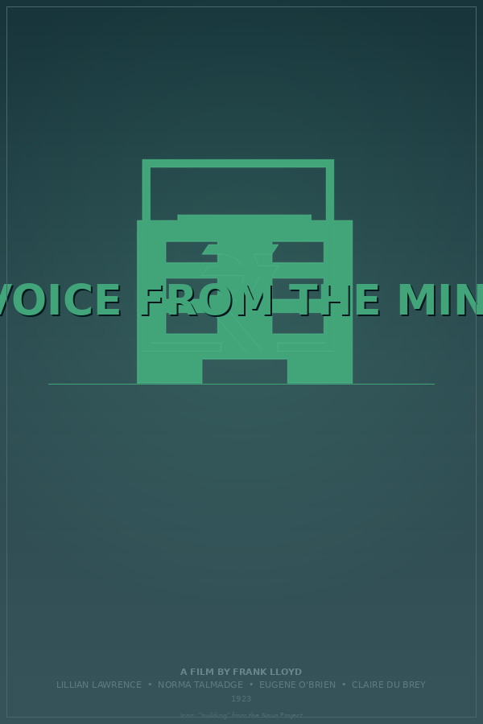

# Semantic NERDS: Poster Generation Narrative

*Generated 2026-03-12 08:55:44 &mdash; seed 99, max 20 ticks*

---

## Standards in play

| Standard | Role | Source |
|---|---|---|
| **RDF + JSON-LD** | Blackboard is an RDF graph; items are triples | W3C Rec 2014/2020 |
| **PROV-O** | Every item traces back to the nerd that made it | W3C Rec 2013 |
| **SKOS** | Item types are concepts in a navigable hierarchy | W3C Rec 2009 |
| **SHACL** | Nerd preconditions are declarative shapes | W3C Rec 2017 |
| **Schema.org** | Movie data uses `schema:Movie` vocabulary | Community std |
| **Dublin Core** | Metadata fields: `dcterms:creator`, `dcterms:type`, etc. | ISO 15836 |
| **Wikidata SPARQL** | Live movie data from the world's knowledge graph | CC0 |
| **Noun Project API** | Genre-relevant icons via OAuth1 | Commercial API |

## Nerds roster

**MoviePicker**, **TitleParser**, **KeywordExtractor**, **GenrePalette**, **TypefacePicker**, **LayoutPicker**, **HeroImageGen**, **IconFetcher**, **GrainEffect**, **Compositor**, **VisibilityCritic**, **ContrastCritic**, **Critic**, **PosterCritic**, **CompletionJudge**

---

## The run

### Tick 1: MoviePicker

Produced: `MovieData`

The MoviePicker queried **Wikidata** via SPARQL for notable films, then selected one at random.

| Field | Value |
|---|---|
| `schema:name` | **The Voice from the Minaret** |
| `schema:director` | Frank Lloyd |
| `schema:genre` | drama |
| `schema:datePublished` | 1923 |
| `schema:actor` | Lillian Lawrence, Norma Talmadge, Eugene O'Brien, Claire Du Brey, Edwin Stevens |

This data arrived as `schema:Movie`-shaped RDF triples, the same vocabulary Google and Wikidata speak. No parsing, no key mapping -- it went straight onto the graph.

### Tick 2: TitleParser

Produced: `TitleChunks`, `TitleChunks`, `TitleChunks`, `TitleChunks`

Title is a single chunk: **"The Voice from the Minaret"**. No subtitle.

### Tick 3: KeywordExtractor

Produced: `Keywords`

Extracted **18 keywords** (source: omdb):
`lord, carlyle, governor, indian, province, type, man, adrienne, beauty, wife` ... (+8 more)

Keywords were extracted from the OMDb short plot by filtering stop words and verb/adjective suffixes.

### Tick 4: Critic

Produced: `Critique`

Completeness: **16%**. Still missing: `missing_palette`, `missing_layout`, `missing_typeface`, `missing_hero_or_composite`, `missing_icon_or_composite`.

### Tick 5: GenrePalette

Produced: `ColorPalette`

Derived a color palette from genre **drama**:

| Role | Hex |
|---|---|
| Key (background) | `#354d59` |
| Accent (text, lines) | `#42a58b` |
| Mid (gradients) | `#3b7972` |

### Tick 6: TitleParser

Produced: `TitleChunks`, `TitleChunks`, `TitleChunks`, `TitleChunks`

Title is a single chunk: **"The Voice from the Minaret"**. No subtitle.

### Tick 7: LayoutPicker

Produced: `Layout`

Chose layout template **"minimalist"**. This sets y-positions for the title, image area, tagline, and credits.

### Tick 8: PosterCritic

Produced: `PosterCritique`

Rendered a temporary poster
(`output/temp/temp_poster_tick8.png`) 
and used the LLM to critique it: **fails**.
LLM score: **0.35**
Summary: This poster fails on fundamental levels. The bizarre title fragmentation demonstrates a misunderstanding of hierarchy and meaning, while the complete absence of visual elements makes this feel like a color palette test rather than a movie poster. The design shows no awareness of the film's subject matter or setting. A drama poster should evoke emotion and intrigue - this evokes nothing.
Issues noted: Title split between main title and subtitle makes no grammatical or thematic sense - 'The Voice from the' is incomplete without 'Minaret',Relegating 'Minaret' to subtitle status buries the most evocative, distinctive word in the title,No imagery or visual elements described - minimalist does not mean empty,Accent color (#42a58b) lacks sufficient contrast against background (#354d59) - both sit in similar mid-tone range,Nothing in the design reflects the Middle Eastern/Islamic setting implied by 'Minaret',Missing standard poster elements: director credit, actor names, tagline, release information,No visual hook or emotional resonance to draw viewers in

### Tick 9: TitleParser

Produced: `TitleChunks`, `TitleChunks`, `TitleChunks`, `TitleChunks`

Title is a single chunk: **"The Voice from the Minaret"**. No subtitle.

### Tick 10: LayoutPicker

Produced: `Layout`

Chose layout template **"minimalist"**. This sets y-positions for the title, image area, tagline, and credits.

### Tick 11: GenrePalette

Produced: `ColorPalette`

Derived a color palette from genre **drama**:

| Role | Hex |
|---|---|
| Key (background) | `#355359` |
| Accent (text, lines) | `#42a579` |
| Mid (gradients) | `#3b7c69` |

### Tick 12: Critic

Produced: `Critique`

Completeness: **50%**. Still missing: `missing_typeface`, `missing_hero_or_composite`, `missing_icon_or_composite`.

### Tick 13: IconFetcher

Produced: `IconImage`

Searched the **Noun Project API** for keyword-derived icons (query: "indian"). Found and downloaded **"Rupee"** (icon #1054888) as a tinted PNG.

### Tick 14: PosterCritic

Produced: `PosterCritique`

Rendered a temporary poster
(`output/temp/temp_poster_tick14.png`) 
and used the LLM to critique it: **fails**.
LLM score: **0.35**
Summary: A well-intentioned but fundamentally misguided design. The Rupee icon betrays a lack of research into the source material and creates an offensive cultural disconnect. The palette lacks dramatic tension, and the fractured title dilutes the film's identity. This reads as a generic placeholder, not a poster for a romantic drama set in the Middle East.
Issues noted: The Rupee icon is thematically incoherent—a minaret is Islamic architecture, and the rupee is Indian currency, creating a jarring cultural mismatch,Title split between 'The Voice' and 'from the Minaret' fractures the poetic weight of the full title and misleads audiences,Color palette reads more tech-startup or wellness brand than drama—lacks emotional depth or tension,Minimalist approach with only a currency symbol fails to convey narrative stakes, character, or atmosphere,No visual connection to the film's Middle Eastern setting or romantic drama themes,Director credit missing from poster entirely

### Tick 15: TitleParser

Produced: `TitleChunks`, `TitleChunks`, `TitleChunks`, `TitleChunks`

Title is a single chunk: **"The Voice from the Minaret"**. No subtitle.

### Tick 16: TypefacePicker

Produced: `Typeface`

Selected typeface **serif-bold** (style: serif, weight: bold). Genre preference had a 60% influence on the pick.

### Tick 17: Critic

Produced: `Critique`

Completeness: **83%**. Still missing: `missing_hero_or_composite`.
Score is >= 80% -- the CompletionJudge can now fire.

### Tick 18: IconFetcher

Produced: `IconImage`

Searched the **Noun Project API** for keyword-derived icons (query: "ministry"). Found and downloaded **"building"** (icon #4907) as a tinted PNG.

### Tick 19: PosterCritic

Produced: `PosterCritique`

Rendered a temporary poster
(`output/temp/temp_poster_tick19.png`) 
and used the LLM to critique it: **passes**.
LLM score: **1.00**

### Tick 20: Compositor

Produced: `CompositeImage`

Composited two images using **ImageMagick** (overlay offset: -12, -56) producing a 412×456 result.
XMP sidecar tracking source positions: `output/temp/composite_tick20_31.xmp`

---

## Timeout

**Max ticks reached (20).** Rendering what we have after 20 ticks.

## The poster



## Provenance (excerpt)

The full provenance graph is exported as Turtle RDF. Here's a sample showing
how PROV-O traces items back through activities to their nerd agents:

```turtle
nerds:Blackboard a nerds:BlackboardSystem ;
    rdfs:label "NERDS Blackboard" ;
    nerds:contains nerds:item_0,
        nerds:item_1,
        nerds:item_10,
        nerds:item_11,
        nerds:item_12,
        nerds:item_13,
        nerds:item_14,
        nerds:item_15,
        nerds:item_16,
        nerds:item_17,
        nerds:item_18,
        nerds:item_19,
        nerds:item_2,
        nerds:item_20,
        nerds:item_21,
        nerds:item_22,
        nerds:item_23,
        nerds:item_24,
        nerds:item_25,
        nerds:item_26,
        nerds:item_27,
        nerds:item_28,
        nerds:item_29,
        nerds:item_3,
        nerds:item_30,
        nerds:item_31,
        nerds:item_4,
        nerds:item_5,
        nerds:item_6,
        nerds:item_7,
        nerds:item_8,
        nerds:item_9 .
```

## Blackboard summary

| Artifact type | Count |
|---|---|
| ColorPalette | 2 |
| CompositeImage | 1 |
| Critique | 3 |
| IconImage | 2 |
| Keywords | 1 |
| Layout | 2 |
| MovieData | 1 |
| PosterCritique | 3 |
| TitleChunks | 16 |
| Typeface | 1 |

---

*Total wall-clock time: 126.0s*

*Generated by Semantic NERDS (week 8) &mdash; a computational caricature
of a blackboard architecture, grounded in W3C semantic web standards.*

*No LLM was used at runtime. Every decision was made by a dumb specialist
reading RDF triples off a shared graph.*
