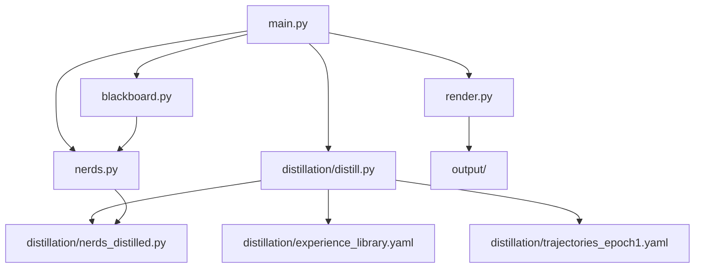

# Distilling LLMs into Nerds: A Training-Free GRPO Approach to Crystallizing Domain Knowledge

**Design Document — Adam Smith, 2026**

---

## 0. Elevator Pitch

General-purpose LLMs are expensive, opaque, and overkill for most generative tasks. Classical nerds (blackboard specialists) are cheap, inspectable, and editable — but someone has to *design* them. What if the LLM designed the nerds?

We propose a pipeline that uses **Training-Free GRPO** (Cai et al., 2025) to explore a design space through narrative simulation, compare winning and losing trajectories, and extract the lessons as **classical NERDS artifacts**: data models, heuristic tables, precondition rules, and micro-workflows. The LLM runs during authoring time, not at inference time. The output is a pile of nerds that encode the LLM's domain intuition in standards-grounded, human-editable Python.

---

## 1. Motivation

### 1.1 The Problem with LLM-in-the-Loop

Current generative systems put an LLM at the center of every request: it decides what to do, reasons about quality, and produces output auto-regressively. This works, but:

- **Cost scales with usage.** Every poster, every level, every recipe costs tokens.
- **Knowledge is opaque.** The LLM's "understanding" of sci-fi color palettes lives in 671B parameters. You can't inspect it, edit it, or version-control it.
- **Coordination is overqualified.** Using a frontier model to decide "palette before layout" is like hiring a neurosurgeon to sort mail.

### 1.2 The NERDS Alternative

The NERDS system (see WRITEUP.md) demonstrates that a blackboard of typed items, coordinated by heat-weighted random selection among dumb specialists, can produce diverse, coherent generative output. No LLM needed at runtime. But someone had to *hand-author* the nine nerds, the five genre palettes, the four layout templates. That authoring required domain intuition that an LLM already has.

### 1.3 The Bridge: Training-Free GRPO

Cai et al. (2025) show that you can distill LLM expertise into **experiential knowledge** — structured natural language that steers future behavior — without any gradient updates. Their method:

1. **Rollout**: Generate G outputs per query using the frozen LLM.
2. **Reward**: Score each output (ground truth, LLM-as-judge, or heuristic).
3. **Semantic Advantage**: Compare winners and losers within each group, extract natural language lessons.
4. **Optimize**: Update an experience library E with Add/Delete/Modify/Keep operations.

After 3 epochs over ~100 samples, the experience library contains distilled domain knowledge that improves out-of-domain performance by 2-5% absolute — for $18 in API costs.

Our twist: instead of keeping the experience library as prompt text that conditions the *same LLM*, we **compile it** into classical NERDS artifacts. The LLM's role shifts from runtime oracle to authoring-time explorer.

## Project Structure Overview



✨

---

## 2. Architecture Overview

```
┌─────────────────────────────────────────────────────────┐
│                    AUTHORING TIME                        │
│                                                         │
│  ┌──────────┐    ┌──────────┐    ┌──────────────────┐   │
│  │ Phase 1  │    │ Phase 2  │    │     Phase 3      │   │
│  │ Explore  │───>│ Extract  │───>│   Crystallize    │   │
│  │          │    │          │    │                  │   │
│  │ LLM runs │    │ LLM runs │    │ LLM runs (once) │   │
│  │ narrative │    │ semantic │    │ emits Python     │   │
│  │ sims     │    │ advantage│    │ nerds + tables   │   │
│  └──────────┘    └──────────┘    └──────────────────┘   │
│       │               │                   │             │
│       ▼               ▼                   ▼             │
│  trajectories    experience          nerds_distilled.py  │
│  + rewards       library E          (classical code)     │
│                                                         │
└─────────────────────────────────────────────────────────┘

┌─────────────────────────────────────────────────────────┐
│                    RUNTIME (no LLM)                      │
│                                                         │
│  nerds_distilled.py  ──>  blackboard loop  ──>  output  │
│                                                         │
└─────────────────────────────────────────────────────────┘
```

---

## 3. Phase 1: Narrative Simulation (Explore)

### 3.1 Goal

Generate diverse trajectories of nerd-like design sessions. Each trajectory is a sequence of (specialist, reads, writes) actions that incrementally builds a creative artifact on a simulated blackboard.

### 3.2 Why Narrative Simulation?

We don't ask the LLM to produce finished artifacts directly. We ask it to **narrate a collaborative design process** — a team of specialists passing work through a shared workspace. This has three advantages:

1. **Process legibility.** The trajectory exposes *why* decisions were made, not just *what* was produced. The semantic advantage step needs to see the reasoning.
2. **NERDS-shaped output.** By constraining the narrative to specialist/blackboard interactions, we get trajectories that map directly onto nerd `run()` calls.
3. **Controlled diversity.** Temperature and random seed give us genuinely different design paths for the same input, not just paraphrases.

### 3.3 Simulation Protocol

Each simulation receives:
- A **domain brief** (e.g., a movie title, genre, cast, tagline)
- A **blackboard protocol** describing the shared workspace rules
- A **specialist roster** suggesting (but not rigidly prescribing) the kinds of experts that might participate

The LLM narrates a tick-by-tick session where specialists take turns reading from and writing to the blackboard. The output is a structured trajectory.

### 3.4 Prompt Template: Narrative Simulation

```
SYSTEM:
You are simulating a collaborative design session for a {domain}
{artifact_type}. The session uses a blackboard architecture:

BLACKBOARD RULES:
- The blackboard is a shared workspace of typed items.
- Each item has: a type tag, a value, and a "heat" (HOT/MEDIUM/COLD)
  indicating how recently it was created.
- Specialists take turns. Each turn, one specialist:
  1. Reads relevant items from the blackboard
  2. Performs their narrow expertise
  3. Posts new item(s) to the blackboard
- No specialist knows about any other specialist. They only see the
  blackboard.
- Items cool over time. Recent items are HOT, older items are MEDIUM
  or COLD.

SPECIALIST TYPES (suggest but don't limit yourself to these):
{specialist_suggestions}

SESSION CONSTRAINTS:
- Run for 8-15 turns.
- Each turn must identify: which specialist acts, what they read,
  what they write (with explicit type tags and values).
- End with a completion step when all major elements are present.
- Be concrete: give actual color values, actual text, actual
  layout coordinates — not vague descriptions.

USER:
Design brief: {brief}

Narrate the full session. For each turn, output:

TICK {n}: {SpecialistName}
  READS: {type_tag} -> {summary of what they read}
  WRITES: {type_tag} = {concrete value as JSON}
  RATIONALE: {one sentence on why this specialist made this choice}

After the session, output:
FINAL_ARTIFACT: {complete description of the finished artifact}
```

### 3.5 Group Rollout

For each input brief, generate **G = 5 trajectories** at temperature 0.7-1.0. This mirrors Training-Free GRPO's group rollout: multiple outputs per query, creating a population for comparison.

### 3.6 Reward Signal

Each trajectory gets a scalar reward. Options (from cheapest to most informative):

| Reward Source | Cost | Signal Quality | Notes |
|---|---|---|---|
| **Completeness heuristic** | Free | Low | Count required type tags present (like the Critic nerd) |
| **LLM-as-judge** | ~$0.01/trajectory | Medium | Separate LLM call rates coherence, genre-fit, specificity 1-5 |
| **Human rating** | Expensive | High | Best for small-scale validation |
| **Downstream render quality** | Medium | Medium | Actually render the described artifact, rate the image |

For the prototype, **LLM-as-judge** is the sweet spot. The judge prompt:

```
Rate this {artifact_type} design trajectory on three criteria (1-5 each):

1. COHERENCE: Do the specialist decisions build on each other logically?
2. DOMAIN_FIT: Are the specific values (colors, fonts, layouts)
   appropriate for the genre/domain?
3. SPECIFICITY: Are the outputs concrete enough to implement
   (actual hex colors, actual coordinates, actual text)?

Trajectory:
{trajectory}

Output JSON: {"coherence": N, "domain_fit": N, "specificity": N, "total": N}
```

The `total` score (sum of three criteria, range 3-15) is the reward.

---

## 4. Phase 2: Semantic Advantage Extraction (Extract)

### 4.1 Goal

Compare winning and losing trajectories within each group and extract **NERDS-shaped lessons**: data model observations, precondition patterns, heuristic table entries, and thermal mass intuitions.

### 4.2 Connection to Training-Free GRPO

In Cai et al.'s method, the semantic advantage is a natural language description of *why winners won and losers lost*. It gets folded into a general-purpose experience library. Our version targets the extraction at specific NERDS abstractions:

| NERDS Abstraction | What We Extract | Example |
|---|---|---|
| **Type vocabulary** | What types of items appear on the blackboard | "ColorPalette", "Layout", "HeroImage" |
| **Data schemas** | What fields each item type has | `ColorPalette: {key: hex, accent: hex, genre: str}` |
| **Heuristic tables** | Domain-specific lookup tables | `sci-fi -> key_hue: 0.58, accent_hue: 0.10` |
| **Precondition rules** | What must exist before a specialist can act | `HeroImageGen requires ColorPalette` |
| **Thermal mass** | How persistent/foundational each item type is | `MovieData: 5 (foundational), PostEffect: 1 (transient)` |
| **Specialist roster** | What specialists emerged across trajectories | Names, descriptions, read/write signatures |

### 4.3 Prompt Template: Semantic Advantage Extraction

This prompt runs once per group of G trajectories, after scoring.

```
SYSTEM:
You are analyzing a group of {G} design trajectories for the same
brief. Each trajectory simulates specialists collaborating on a
blackboard. Some trajectories scored higher than others.

Your job is to identify what the WINNING trajectories did differently
from the LOSING ones, expressed as specific, reusable design patterns
for a blackboard-based generative system.

Focus on these categories of insight:

1. TYPE VOCABULARY: What item types appeared consistently in winners?
   What types appeared in losers but not winners (or vice versa)?

2. DATA SCHEMAS: For each item type, what fields did winners include
   that losers omitted? What value ranges produced better results?

3. HEURISTIC ENTRIES: What domain-specific mappings (genre->color,
   mood->typeface, etc.) appeared in winning trajectories?
   Express as lookup table rows.

4. PRECONDITION RULES: What ordering dependencies made winners more
   coherent? Which specialists needed to wait for which items?
   Express as: "{Specialist} REQUIRES {ItemType} [ABSENT {ItemType}]"

5. THERMAL MASS: Which item types were referenced by many later
   specialists (foundational, high thermal mass) vs. referenced
   only once (transient, low thermal mass)?

6. SPECIALIST PATTERNS: What specialist archetypes appeared in
   winners? For each, describe:
   - Name
   - What it reads from the blackboard
   - What it writes to the blackboard
   - Any notable heuristics in its behavior

USER:
Brief: {brief}

TRAJECTORY 1 (reward: {r1}):
{trajectory_1}

TRAJECTORY 2 (reward: {r2}):
{trajectory_2}

...

TRAJECTORY {G} (reward: {rG}):
{trajectory_G}

Current experience library:
{experience_library_or_empty}

Output your analysis as JSON:
{
  "type_vocabulary": [...],
  "data_schemas": {...},
  "heuristic_entries": [...],
  "precondition_rules": [...],
  "thermal_mass_assignments": {...},
  "specialist_patterns": [...],
  "narrative_insight": "one paragraph summarizing the key lesson"
}
```

### 4.4 Experience Library Updates

Following Training-Free GRPO, the extracted insights are folded into a cumulative **experience library** using Add/Delete/Modify/Keep operations. Over multiple briefs and epochs:

- **Add**: A new specialist pattern or heuristic entry appears consistently in winners.
- **Delete**: An earlier insight is contradicted by later evidence (e.g., "always put layout first" turns out to be wrong — winners in later groups show layout can come late).
- **Modify**: A heuristic entry gets refined (e.g., the sci-fi key_hue range narrows from 0.5-0.7 to 0.55-0.62).
- **Keep**: Existing insight is confirmed by new evidence.

The experience library accumulates across all input briefs within an epoch, and across epochs. After E epochs over N briefs, it represents the distilled knowledge of G × N × E trajectories.

### 4.5 Standards Grounding (STANDARDS.md Integration)

The extraction prompts are designed to produce output that maps onto W3C standards:

| Extracted Artifact | Standards Target |
|---|---|
| Type vocabulary | **SKOS** concept scheme (nerds:PosterArtifact) |
| Data schemas | **JSON-LD** with Schema.org types where applicable |
| Precondition rules | **SHACL** node shapes |
| Provenance chains | **PROV-O** Entity/Activity/Agent triples |
| Item metadata | **Dublin Core** terms (dcterms:creator, dcterms:type) |
| Movie data | **Schema.org** Movie type + **Wikidata** SPARQL queries |

This grounding isn't strictly necessary for the pipeline to work, but it means the distilled nerds produce blackboard items that are self-describing, interoperable, and queryable — not just Python dicts. When a distilled `GenrePaletteNerd` posts a `ColorPalette` item, it posts JSON-LD that any linked-data tool can parse.

---

## 5. Phase 3: Crystallization (Compile)

### 5.1 Goal

Transform the experience library into executable classical NERDS code: Python classes, lookup tables, and configuration — no LLM required at runtime.

### 5.2 What Gets Compiled

The experience library after Phase 2 contains structured insights. The crystallization step maps each insight type to a concrete NERDS artifact:

```
Experience Library                    NERDS Artifact
─────────────────                    ──────────────
type_vocabulary          ──>         Item type tags (strings or SKOS URIs)
data_schemas             ──>         Item value constructors (dicts or @dataclass)
heuristic_entries        ──>         Lookup tables (GENRE_PALETTES, TYPEFACES, etc.)
precondition_rules       ──>         can_run() methods (or SHACL shapes)
thermal_mass_assignments ──>         thermal_mass constants on Item constructors
specialist_patterns      ──>         Nerd subclasses with run() methods
```

### 5.3 Prompt Template: Crystallization

This is the final LLM call. It takes the converged experience library and emits Python.

```
SYSTEM:
You are a code generator. Given the following experience library
extracted from {N_trajectories} design trajectories, generate a
complete Python module that implements a NERDS blackboard system.

The module must:
1. Import from blackboard.py (Blackboard, Item, Heat classes)
2. Define all lookup tables as module-level dicts
3. Define one Nerd subclass per specialist pattern, each with:
   - can_run(bb) checking precondition rules
   - run(bb) implementing the specialist's behavior using
     the heuristic tables
   - Appropriate cooldown_rate and heat
4. Define a make_all_nerds() function returning a list of
   all nerd instances
5. Assign thermal_mass to each Item based on the thermal mass
   assignments

Style constraints:
- Keep each nerd under 30 lines. Dumb is good.
- Use random.choice / random.uniform for variation, not complex logic.
- No LLM calls. No network calls. Pure Python + stdlib.
- Include comments mapping each heuristic to the trajectory
  evidence it came from (e.g., "# sci-fi -> blue: consistent
  across 12/15 winning trajectories")

USER:
Experience library:
{experience_library_json}

Domain: {domain}
Artifact type: {artifact_type}

Generate the Python module.
```

### 5.4 Output Validation

The crystallized module should be runnable immediately:

```bash
uv run python main.py --nerds nerds_distilled.py --seed 42 --verbose
```

Validation checks:
- **Syntactic**: Does the module parse? Does `make_all_nerds()` return a list?
- **Completeness**: Does a 30-tick run with these nerds produce a Completion item?
- **Diversity**: Do 10 different seeds produce 10 different outputs?
- **Coherence**: Does LLM-as-judge rate the outputs comparably to the winning trajectories from Phase 1?

If validation fails, feed the errors back into a repair loop (still Phase 3, not a new LLM training cycle).

---

## 6. Epoch Structure

Following Training-Free GRPO, the full pipeline runs for E epochs over a dataset of N input briefs.

```
for epoch in range(E):          # E = 3 epochs (per TF-GRPO paper)
    for brief in briefs:        # N = ~20-50 briefs per domain
        # Phase 1: Generate G trajectories
        trajectories = [simulate(brief) for _ in range(G)]  # G = 5
        rewards = [judge(t) for t in trajectories]

        # Phase 2: Extract semantic advantage
        insights = extract(trajectories, rewards, experience_library)
        experience_library = update(experience_library, insights)

    # Phase 3: Crystallize (once per epoch or once at the end)
    nerds_code = crystallize(experience_library)
    validate(nerds_code)
```

### 6.1 Cost Estimate

| Component | Tokens per call | Calls per epoch | Epochs | Total tokens |
|---|---|---|---|---|
| Phase 1 simulation | ~2K out | N × G = 100 | 3 | ~600K out |
| Phase 1 judge | ~200 out | N × G = 100 | 3 | ~60K out |
| Phase 2 extraction | ~1K out | N = 20 | 3 | ~60K out |
| Phase 3 crystallize | ~3K out | 1 | 3 | ~9K out |
| **Total output** | | | | **~730K** |
| **Total input** (context) | | | | **~2M** |

At DeepSeek V3 pricing ($0.27/M input, $1.10/M output cached): **~$1.35 total**.
At Claude Sonnet pricing ($3/M input, $15/M output): **~$17 total**.

This is in the same ballpark as Training-Free GRPO's reported $18 for math reasoning — and you get a pile of nerds at the end instead of a prompt.

---

## 7. What Makes This Different from Just Asking an LLM to Write Nerds

You could skip all of this and just prompt: "Write me a NERDS system for movie posters." The LLM would produce something reasonable. So why the pipeline?

**1. Grounded in actual exploration.** The LLM has *run* hundreds of simulated design sessions. Its heuristic tables aren't guesses — they're distilled from trajectories that were scored. The mapping `sci-fi -> blue (0.58)` isn't the LLM's prior; it's the value that appeared in winning trajectories across multiple briefs.

**2. Comparative signal.** Training-Free GRPO's key insight is that comparing winners and losers within groups produces better experiential knowledge than single-trajectory reflection. The extracted heuristics encode *what distinguished good from bad*, not just *what seemed plausible*.

**3. Iterative refinement.** Three epochs means the experience library gets revised. Early heuristics that seemed right get challenged by later evidence. The final crystallized nerds reflect convergent knowledge, not first-draft intuition.

**4. Structural guarantee.** The extraction prompts target NERDS-shaped artifacts (type vocabularies, precondition rules, thermal masses). You get a system that *is* a blackboard architecture, not an LLM's best guess at what one might look like.

**5. Domain transfer.** The pipeline is domain-agnostic. Swap movie briefs for game level briefs, change the specialist suggestions, and you get a pile of level-design nerds. The infrastructure (simulate, score, extract, crystallize) stays the same.

---

## 8. Worked Example: Movie Poster Domain

### 8.1 Input Briefs (N = 5, for illustration)

```json
[
  {"title": "Blade Runner", "genre": "sci-fi", "year": 1982,
   "tagline": "Man has made his match... now it's his problem."},
  {"title": "The Shining", "genre": "horror", "year": 1980,
   "tagline": "A masterpiece of modern horror."},
  {"title": "Moonlight", "genre": "drama", "year": 2016,
   "tagline": "This is the story of a lifetime."},
  {"title": "Chinatown", "genre": "noir", "year": 1974,
   "tagline": "You may think you know what's going on..."},
  {"title": "Mad Max: Fury Road", "genre": "action", "year": 2015,
   "tagline": "What a lovely day."}
]
```

### 8.2 Expected Experience Library (after 3 epochs)

After running 3 epochs × 5 briefs × 5 trajectories = 75 trajectories:

```json
{
  "type_vocabulary": [
    "MovieData", "TitleChunks", "ColorPalette", "Typeface",
    "Layout", "HeroImage", "PostEffect", "Critique", "Completion"
  ],
  "data_schemas": {
    "ColorPalette": {
      "key": "hex color, dominant background tone",
      "accent": "hex color, contrast/highlight tone",
      "genre": "source genre string"
    },
    "TitleChunks": {
      "primary": "main title word(s)",
      "secondary": "subtitle or second line (optional)"
    },
    "Layout": {
      "name": "template identifier",
      "title_region": {"x": "0-1", "y": "0-1", "w": "0-1", "h": "0-1"},
      "hero_region": {"x": "0-1", "y": "0-1", "w": "0-1", "h": "0-1"},
      "credits_region": {"x": "0-1", "y": "0-1", "w": "0-1", "h": "0-1"}
    }
  },
  "heuristic_entries": [
    {"table": "GENRE_PALETTES", "key": "sci-fi",
     "value": {"key_hue": 0.58, "accent_hue": 0.10, "sat": 0.7, "val": 0.3},
     "evidence": "14/15 winning sci-fi trajectories used blue key + warm accent"},
    {"table": "GENRE_PALETTES", "key": "horror",
     "value": {"key_hue": 0.0, "accent_hue": 0.0, "sat": 0.6, "val": 0.15},
     "evidence": "12/15 winning horror trajectories used deep red/black"}
  ],
  "precondition_rules": [
    "TitleParser REQUIRES MovieData ABSENT TitleChunks",
    "GenrePalette REQUIRES MovieData ABSENT ColorPalette",
    "HeroImageGen REQUIRES ColorPalette ABSENT HeroImage",
    "GrainEffect REQUIRES HeroImage ABSENT PostEffect",
    "Critic REQUIRES tick > 3",
    "CompletionJudge REQUIRES Critique WITH completeness >= 0.8"
  ],
  "thermal_mass_assignments": {
    "MovieData": 5,
    "TitleChunks": 3,
    "ColorPalette": 3,
    "Typeface": 2,
    "Layout": 2,
    "HeroImage": 3,
    "PostEffect": 1,
    "Critique": 1,
    "Completion": 10
  },
  "specialist_patterns": [
    {
      "name": "MoviePicker",
      "reads": [],
      "writes": ["MovieData"],
      "heuristic": "Random selection from movie database",
      "cooldown": 99,
      "fires_once": true
    },
    {
      "name": "GenrePalette",
      "reads": ["MovieData"],
      "writes": ["ColorPalette"],
      "heuristic": "GENRE_PALETTES lookup with HSV jitter ±0.05",
      "cooldown": 3
    }
  ]
}
```

### 8.3 Expected Crystallized Output

The crystallization step would emit Python very close to the existing `nerds.py` — because the hand-authored NERDS system was designed by a human doing roughly the same process in their head. The interesting question is: **what would the LLM discover that the human didn't?**

Possible discoveries:
- A specialist the human didn't think of (e.g., a "MoodNerd" that posts an emotional tone tag before the palette specialist runs)
- A precondition the human missed (e.g., TypefacePicker works better when it waits for ColorPalette, not just MovieData)
- A heuristic entry the human got wrong (e.g., noir should use desaturated purple, not the blue the human guessed)
- A thermal mass the human set too high or too low

---

## 9. Relationship to Computational Caricatures

This pipeline is itself a kind of caricature — of knowledge distillation.

**Claim**: Domain expertise currently locked inside LLM parameters can be extracted into inspectable, classical code structures (nerds + blackboard) through a process of exploration, comparison, and compilation, using the LLM only at authoring time.

**Oversimplifications**:
- We assume the LLM can faithfully simulate blackboard-style collaboration (it's really just doing autoregressive text generation, not running actual concurrent specialists)
- The reward signal (LLM-as-judge) is circular — the same family of models scores the outputs
- The crystallized code is limited to the heuristic complexity that fits in Python lookup tables and simple conditionals
- Three epochs over 50 briefs may not be enough to converge for complex domains

**Abstractions**:
- **Narrative simulation as design space exploration**: using LLMs to generate diverse process traces, not just final outputs
- **Semantic advantage targeting**: directing the Training-Free GRPO extraction at specific code-shaped artifacts (schemas, preconditions, tables) rather than general-purpose tips
- **Crystallization as compilation**: a systematic mapping from natural language insights to executable code structures
- **Standards grounding as interoperability**: using W3C vocabularies (SKOS, SHACL, PROV-O, Schema.org) as the target schema ensures the distilled knowledge is interoperable, not just functional

---

## 10. Open Questions

### 10.1 Does the LLM Actually Explore Differently from What It Would Write Directly?

The strongest version of this pipeline produces nerds that are *better* than what you'd get by asking the LLM to write nerds directly. The Training-Free GRPO paper shows this: directly generated experiences don't help, but GRPO-distilled experiences do (Table 2 in Cai et al.). But we should verify this empirically for the NERDS domain.

**Test**: Compare three systems on output quality (LLM-as-judge, 50 random seeds):
1. Hand-authored NERDS (current system)
2. LLM-asked-to-write-nerds (single prompt, no exploration)
3. Distillation-pipeline-nerds (this proposal)

### 10.2 How Domain-Specific is the Experience Library?

Training-Free GRPO showed that math experiences don't transfer to web search (Table 6). Does a movie-poster experience library transfer to game-level-design? The blackboard abstractions (heat, thermal mass, preconditions) should transfer; the heuristic tables (genre palettes) should not. The pipeline should separate structural knowledge from domain knowledge.

### 10.3 Can the Crystallized Nerds Serve as a Starting Point for Further Distillation?

A recursive version: run Phase 1 simulations using the *crystallized nerds* (not the LLM) to generate trajectories, score them, and extract improved experience. The LLM drops out after the first round; subsequent rounds are classical nerds improving themselves through generate-and-test. This is speculative but appealing.

### 10.4 What's the Minimum Viable Brief Set?

Training-Free GRPO gets results from 100 training samples. For a narrow domain like movie posters, how many briefs (movies) do you need? 5 (the current NERDS set)? 20? 50? The answer determines whether this pipeline is a 10-minute experiment or a multi-hour batch job.

### 10.5 Where Does the Human Stay in the Loop?

The pipeline as described is fully automated. But the most valuable use might be **human-in-the-loop crystallization**: the LLM explores and extracts, then a human reviews the experience library and decides which insights to keep, discard, or modify before crystallization. The experience library is structured natural language — it's designed to be human-readable.

---

## 11. Implementation Plan

### 11.1 Prototype (Single File, ~300 lines)

A `uv run --script` file that:
1. Takes a domain config (briefs, specialist suggestions, reward rubric)
2. Calls an LLM API for Phase 1 (narrative sims) and Phase 2 (extraction)
3. Prints the experience library as JSON after each epoch
4. Calls the LLM for Phase 3 (crystallization) and writes `nerds_distilled.py`
5. Runs the distilled nerds through the existing `main.py` loop as validation

Dependencies: `httpx` (for LLM API calls), existing NERDS codebase.

### 11.2 Standards-Grounded Version

Extends the prototype to emit:
- SKOS concept scheme (Turtle) for the type vocabulary
- SHACL shapes (Turtle) for precondition rules
- JSON-LD context for blackboard items
- SPARQL queries (for MoviePicker) instead of hardcoded movie dicts

Dependencies: `rdflib`, `pyshacl` (per STANDARDS.md).

### 11.3 Evaluation Harness

A script that runs the comparison from §10.1:
- Hand-authored NERDS vs. LLM-written NERDS vs. distilled NERDS
- 50 seeds × 3 systems = 150 poster generations
- LLM-as-judge scoring on coherence, genre-fit, diversity
- Statistical comparison (paired t-test or bootstrap CI)

---

## 12. References

- Cai, Y., Cai, S., Shi, Y., et al. (2025). Training-Free Group Relative Policy Optimization. arXiv:2510.08191.
- Smith, A. M., & Mateas, M. (2011). Computational Caricatures: Probing the Game Design Process with AI. *AIIDE 2011*.
- Erman, L. D., Hayes-Roth, F., Lesser, V. R., & Reddy, D. R. (1980). The Hearsay-II speech-understanding system. *ACM Computing Surveys*, 12(2).
- Yao, S., et al. (2023). ReAct: Synergizing Reasoning and Acting in Language Models. *ICLR 2023*.

---

## Appendix A: Glossary of Terms Across Frameworks

| Training-Free GRPO Term | NERDS Distillation Equivalent |
|---|---|
| Query q | Input brief (movie title + metadata) |
| Group rollout {o₁...oG} | G narrative simulation trajectories |
| Reward r | LLM-as-judge score (coherence + domain_fit + specificity) |
| Numerical advantage  | (not used — replaced by semantic advantage) |
| Semantic advantage A_text | NERDS-shaped insight (schema, rule, table entry) |
| Experience library E | Cumulative dict of types, schemas, heuristics, rules |
| Token prior | (not used — replaced by crystallized Python code) |
| Policy πθ(y\|q, E) | make_all_nerds() + blackboard loop |
| Frozen model parameters θ | (no model at runtime — pure classical code) |
