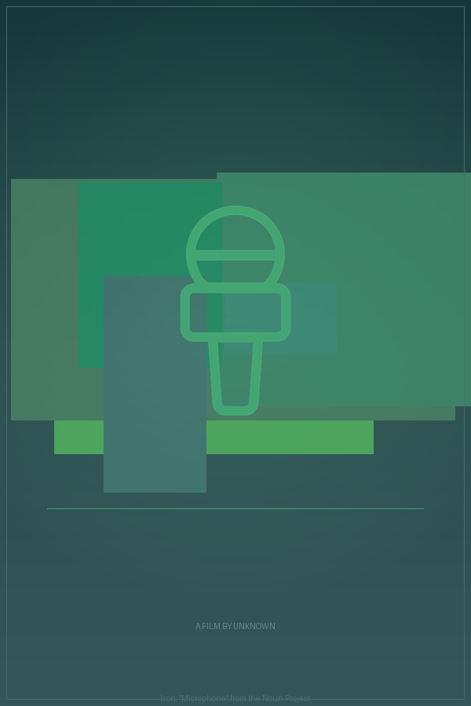

# Semantic NERDS: Poster Generation Narrative

*Generated 2026-03-04 16:36:46 &mdash; seed random, max 30 ticks*

---

## Standards in play

| Standard | Role | Source |
|---|---|---|
| **RDF + JSON-LD** | Blackboard is an RDF graph; items are triples | W3C Rec 2014/2020 |
| **PROV-O** | Every item traces back to the nerd that made it | W3C Rec 2013 |
| **SKOS** | Item types are concepts in a navigable hierarchy | W3C Rec 2009 |
| **SHACL** | Nerd preconditions are declarative shapes | W3C Rec 2017 |
| **Schema.org** | Movie data uses `schema:Movie` vocabulary | Community std |
| **Dublin Core** | Metadata fields: `dcterms:creator`, `dcterms:type`, etc. | ISO 15836 |
| **Wikidata SPARQL** | Live movie data from the world's knowledge graph | CC0 |
| **Noun Project API** | Genre-relevant icons via OAuth1 | Commercial API |

## Nerds roster

**MoviePicker**, **TitleParser**, **GenrePalette**, **TypefacePicker**, **LayoutPicker**, **HeroImageGen**, **IconFetcher**, **GrainEffect**, **Critic**, **CompletionJudge**

---

## The run

### Tick 1: LayoutPicker

Produced: `Layout`

Chose layout template **"classic-centered"**. This sets y-positions for the title, image area, tagline, and credits.

### Tick 2: MoviePicker

Produced: `MovieData`

The MoviePicker queried **Wikidata** via SPARQL for notable films, then selected one at random.

| Field | Value |
|---|---|
| `schema:name` | **Ott Tänak: The Movie** |
| `schema:director` | Unknown |
| `schema:genre` | drama |

This data arrived as `schema:Movie`-shaped RDF triples, the same vocabulary Google and Wikidata speak. No parsing, no key mapping -- it went straight onto the graph.

### Tick 3: GenrePalette

Produced: `ColorPalette`

Derived a color palette from genre **drama**:

| Role | Hex |
|---|---|
| Key (background) | `#355659` |
| Accent (text, lines) | `#42a572` |
| Mid (gradients) | `#3b7e65` |

### Tick 4: HeroImageGen

Produced: `HeroImage`

Generated **7 overlapping color-field blocks** with varying opacity, derived from the palette. These form the abstract background texture behind the icon.

### Tick 5: IconFetcher

Produced: `IconImage`

Searched the **Noun Project API** (OAuth1) for genre-relevant icons. Found and downloaded **"Microphone"** (icon #140225) as a tinted PNG.

This is the visual quality leap: a professionally designed icon from a curated library of millions, replacing the colored rectangles of week 7.

### Tick 6: TypefacePicker

Produced: `Typeface`

Selected typeface **script-italic** (style: script, weight: italic). Genre preference had a 60% influence on the pick.

### Tick 7: Critic

Produced: `Critique`

Completeness: **83%**. Still missing: `missing_title`.
Score is >= 80% -- the CompletionJudge can now fire.

### Tick 8: CompletionJudge

Produced: `Completion`

The CompletionJudge reviewed the latest critique, found the score >= 80%, and **declared the poster complete**.

---

## Completion

**Poster declared complete at tick 8.**

- 8 items on the blackboard
- 216 RDF triples in the graph

## The poster



## Provenance (excerpt)

The full provenance graph is exported as Turtle RDF. Here's a sample showing
how PROV-O traces items back through activities to their nerd agents:

```turtle
nerds:Blackboard a nerds:BlackboardSystem ;
    rdfs:label "NERDS Blackboard" ;
    nerds:contains nerds:item_0,
        nerds:item_1,
        nerds:item_2,
        nerds:item_3,
        nerds:item_4,
        nerds:item_5,
        nerds:item_6,
        nerds:item_7 .

nerds:PostEffect a skos:Concept ;
    rdfs:comment "Film grain, vignette, or posterization flags." ;
    skos:broader nerds:VisualArtifact ;
    skos:inScheme nerds:PosterArtifact ;
    skos:prefLabel "Post Effect"@en .

nerds:TitleChunks a skos:Concept ;
    rdfs:comment "Primary and secondary title text segments." ;
    skos:broader nerds:TypographicArtifact ;
    skos:inScheme nerds:PosterArtifact ;
    skos:prefLabel "Title Chunks"@en .

nerds:ColorPalette a skos:Concept ;
    rdfs:comment "Genre-derived key and accent colors." ;
    skos:broader nerds:VisualArtifact ;
    skos:inScheme nerds:PosterArtifact ;
    skos:prefLabel "Color Palette"@en .

nerds:Completion a skos:Concept ;
    rdfs:comment "Signal that the poster is done." ;
    skos:broader nerds:MetaArtifact ;
    skos:inScheme nerds:PosterArtifact ;
    skos:prefLabel "Completion"@en .
```

## Blackboard summary

| Artifact type | Count |
|---|---|
| ColorPalette | 1 |
| Completion | 1 |
| Critique | 1 |
| HeroImage | 1 |
| IconImage | 1 |
| Layout | 1 |
| MovieData | 1 |
| Typeface | 1 |

---

*Total wall-clock time: 11.3s*

*Generated by Semantic NERDS (week 8) &mdash; a computational caricature
of a blackboard architecture, grounded in W3C semantic web standards.*

*No LLM was used at runtime. Every decision was made by a dumb specialist
reading RDF triples off a shared graph.*
